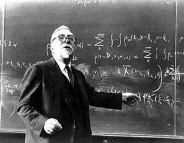
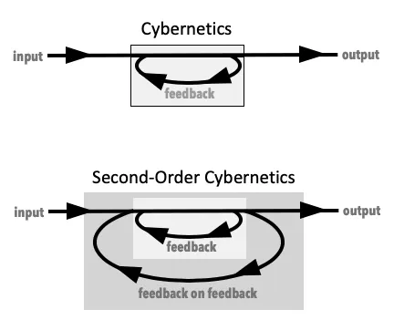

# Cybernetics: A Brief Introduction 

  
Norbert Wiener

Cybernetics was conceived of by Norbert Wiener in his seminal work *Cybernetics Or Control and Communication in the Animal and the Machine* of 1948. It was heavily influenced by WWII military technology and the emergent Information Theory by Claude Shannon.  

Definition:  
Cybernetics is the study of the communication and control of regulatory feedback both in living and lifeless systems (organisms, organizations, machines), and in combinations of those. Its focus is how anything (digital, mechanical or biological) controls its behavior, processes information, reacts to information, and changes or can be changed to better accomplish those three primary tasks.

Cybernetics is based on three foundational concepts: switching (Boolean) algebra, information theory, and feedback which assumes 'digitality'.  

## key concepts

### feedback
The fundamental principle of cybernetics is that systems, whether biological, mechanical, ecological, or social, are self-regulating through feedback mechanisms. This self-regulation enables systems to adapt, learn, and maintain their organization despite changing conditions. 

There are two primary types of **feedback loops** in cybernetic systems: **positive** and **negative**. Positive feedback loops amplify the initial stimulus, leading to exponential growth or decline, and can result in runaway conditions such as population explosions, inflation, or the proliferation of cancer cells. These loops are divergent and can destabilize a system, potentially leading to its destruction if unchecked.  

In contrast, negative feedback loops work to reduce the discrepancy between the actual state and a desired goal state, promoting stability, equilibrium, and homeostasis. Examples include a thermostat regulating room temperature or the human body maintaining blood glucose levels.  

  

This idea has since been applied across diverse fields, including engineering, neuroscience, psychology, sociology, and artificial intelligence, where feedback loops are essential for learning and adaptation.  
Cybernetics as a self-regulating system therefore became highly influential. It's interdisciplinary nature made it to be seen as a meta-science. Notable people that got inspiration from cybernetics are James Lovelock (GAIA theory), Milton Friedman (free market principle), Marshall McLuhan (media theory), Stafford Beer (management cybernetics), Niklas Luhmann (systems theory) and so many more.  

  
A rather ambitious project from the early 1970s is worth mentioning here. The Chilean government invited the renown UK cybernetician Stafford Beer to convert the whole Chilean economy into a cybernetic controlled society.  
[Cybersyn documentary at Youtube](https://youtu.be/_SIwml2OBho)  

The easiest way to get at what is special about British cybernetics is to talk about its ontology, by which I mean its overall vision of what the world is like. This hinges on questions of knowability and unknowability. Conventional sciences, like physics, take it for granted that the world is knowable and that we will sooner or later find out what it
is made of—quarks, black holes, the double helix of DNA, and so on.  
That is the ontology or worldview of modern science and of Western common sense; an ontology, we could say, of knowability. That is what we teach our children. Cybernetics went in the opposite direction. In 1959, Stafford Beer, the founder of management cybernetics, defined cybernetics as the science of exceedingly complex systems, meaning systems that are either so complex we will never fully understand
them, or systems that are lively and always changing so that we can never pin them down. The key point then is, that unlike the conventional sciences, cybernetics did not aim at producing positive knowledge about the world. Instead it was about getting along, we could say, with an unknowable and unmasterable universe. More prosaically, it was about adaptive systems—systems that can somehow come to terms
with the unexpected.  
>Pickering, Andrew - Cybernetics in Britain

### autopoiesis
Autopoiesis literally means “auto (self)-creation” (from the Greek: auto - αυτό for self- and poiesis - ποίησις for creation or production) and expresses a fundamental complementarity between structure and function. The term was originally introduced by Chilean biologists Francisco Varela and Humberto Maturana in 1973:

"An autopoietic machine is a machine organized (defined as a unity) as a network of processes of production (transformation and destruction) of components which: (i) through their interactions and transformations continuously regenerate and realize the network of processes (relations) that produced them; and (ii) constitute it (the machine) as a concrete unity in space in which they (the components) exist by specifying the topological domain of its realization as such a network.“   
>Maturana, Varela, 1973, p. 78  

They give as an example of an autopoiesis system the biological cell as made of various biochemical components and organized in bounded structures such as the cells nucleus, organelles, cell membrane, etc. These structures, based on an external flow of molecules and energy, produce the components which, in turn, continue to maintain the organized bounded structure that gives rise to these components.  
Luhmann applied these concepts to sociology in systems theory to name another example. Relate this also to self-regulation in ecological systems (GAIA) and the free market ideology.  

From this very general point of view, the notion of autopoiesis is often associated with that of self-organization.  

### emergence
“Emergence happens when you switch the focus of attention from one scale to the coarser scale above it. A certain behaviour, observed at a certain scale, is said to be emergent if it cannot be understood when you study, separately and one by one, every constituent of Entropy this scale, each of which may also be a complex system made up of finer scales. Thus the emerging behaviour is a new phenomenon special to the scale considered, and it results from global interactions between the scale’s constituents. Trivial example: the human body is capable of walking. This is an emerging property of the highest scale mentioned earlier. If you study only a head, or only a trunk, or only a leg, you will never understand walking“  
>Baranger, Michel - Chaos, Complexity, and Entropy  

Peter Cariani points to Gordon Pask´s successful experiment from 1956 or 1957 with a solution of iron sulfide and electrodes giving rise to formations of iron filings that become audio sensitive. In this extreme form of emergence something new comes into being. 
During the experiment Gordon Pask said to Stafford Beer: *”It´s growing an ear.”*  

Many more examples of emergence, for example cellular automata, boids, or in general when a number of small elements with a simple behaviour gives rise to observed complexity.  

*"It is easy to make a simple machine which will run toward the light or run away from it, and if such machines also contain lights of their own, a number of them together will show complicated forms of social behavior."*  
Norbert Wiener

### complexity, entropy, recursion
#### entropy
Some definitions:  
The state of disorder, randomness or uncertainty.

Which can also be defined as the possible number of states of a system.  

or  
The tendency of energy to spread out over time.  

*"I think there are the strongest grounds for placing entropy alongside beauty and melody. . . . Entropy is only found when the parts are viewed in association, and it is by viewing or hearing the parts in association that beauty and melody are discerned. All three are features of arrangement."*
>Arthur S. Eddington - The Nature of the Physical World

[tbd: expand, 2nd law thermodynamics]  

#### recursion
Recursion (writing again), also known as the re-entry of a form into a form. They are also examples of self-reference (reflexivity), as can be clearly seen in the form, “I imagine me imagining me imagining me imagining me …”
I imagine is a process; the me’s and you’s I am imagining are the products of that process.  
>Scott, Bernard (2021) - Cybernetics for the Social Sciences p.2  

[in python coding](https://youtu.be/Qk0zUZW-U_M)  
[tbd: expand section]  

#### complexity
[tbd: chaos, etc.]  

---
# second-order cybernetics
  
*“First-order cybernetics is the science of observed systems; Second-order cybernetics is the science of observing systems.”*  
  
*"Should one name one central concept, a first principle, of cybernetics, it would be circularity."*  
Heinz von Foerster 

Second-order cybernetics, also known as the cybernetics of cybernetics or the new cybernetics, is a distinct tradition within cybernetics that emerged between the late 1960s and mid-1970s, primarily developed by Heinz von Foerster and others. It is characterized by the recursive application of cybernetics to itself, emphasizing the role of the observer as an integral part of the system being studied, rather than a detached entity. This approach takes "circularity seriously," recognizing that the observer and the observed are interdependent and co-constructing systems. It arose from concerns evident during the Macy Conferences, where cybernetics was initially developed, and was significantly influenced by Margaret Mead's 1967 address to the American Society for Cybernetics, which called for cyberneticians to take responsibility for the social consequences of their work.

The core distinction lies between first-order cybernetics, which studies "observed systems" from an external, objective standpoint, and second-order cybernetics, which studies "observing systems," acknowledging that the observer is part of the system and their own observations are subject to the same principles of self-reference and circular causality. This shift leads to a focus on epistemology, ethics, language, reflexivity, self-consistency, self-referentiality, and the self-organizing capabilities of complex systems. Second-order cybernetics critiques the traditional scientific objectivity, arguing that all knowledge is mediated by models created by observers, and thus the properties of a system are distinguished from those of its model, which depend on the observer's purpose. This perspective has strong affinities with radical constructivism, developed by Ernst von Glasersfeld, and has influenced fields such as **action research, design, and the creative arts.**

The approach has significant implications for research methodology, suggesting that science should be conducted "from within" the system being studied, particularly in social, management, environmental, and life sciences. It challenges the notion of absolute truth, proposing that reality is self-referential and constructed through interaction, meaning there is no single correct way to perceive or live. In therapy, for example, a second-order approach views the problem as co-constructed by the client and therapist through language, and change involves creating new linguistic distinctions to generate innovative solutions. While sometimes seen as a break from earlier cybernetics, there is substantial continuity, with many foundational figures like Ashby, McCulloch, and Bateson implicitly acknowledging the importance of autonomy and the observer's role.   

---
# 6 Key Ideas of 2nd Order Cybernetics Explained
by Carlos E. Perez @ [intuitionmachine](https://medium.com/intuitionmachine/6-key-ideas-of-2nd-order-cybernetics-explained-83c5692a1a77).  
(AI generated?)

## 1. Observer-Dependence Explained

### What Observer-Dependence Really Means
Imagine you’re at an art gallery looking at a painting. Traditional science would say there’s:  

- An objective painting (with specific colors, shapes, etc.)
- You as a separate observer
- A neutral process of observation

Von Foerster says this is fundamentally wrong. Instead:  

**The painting you experience is created through your interaction with it.**  Your personal history, mood, cultural background, artistic knowledge, and even where you stand in the room all shape what you “see.” Two people never see exactly the same painting.  

### A Practical Example
Take something simple like a red apple:  

- Science traditionally says: “The apple is objectively red.”  
- Von Foerster says: “Redness” isn’t in the apple — it emerges from:  
- The apple’s physical properties that reflect certain wavelengths  
- Your visual system that detects those wavelengths  
- Your brain’s interpretation based on previous experiences with “red” things  

Without an observer with a specific perceptual system, “redness” doesn’t exist. The quality emerges from the relationship.  

### The Deeper Implication
This means reality isn’t something we passively receive — it’s something we actively co-create through observation. The process of observing changes both the observed and the observer.  

Think of it like this: When scientists study quantum particles, the very act of measurement influences what they measure. Von Foerster argues this isn’t just true for quantum physics — it’s true for ALL observation, including our everyday experiences of reality.  

The QPT notation I used was mapping this dance between observer and observed as a continuous, circular relationship rather than a one-way process of “receiving” objective information.  

## 2. Self-Referential Systems Explained
Von Foerster’s second principle about “self-referential systems” is perhaps one of his most profound insights, though it can sound quite abstract. Let me break it down:  

### The Mirror That Observes Itself
Imagine your mind as a mirror. Most traditional science treats the mind as simply reflecting the outside world. But Von Foerster says something more interesting is happening: your mind is a mirror that can turn and look at itself.  

### What This Means in Practice
When you think, you’re not just processing information from outside — you’re also processing your own thoughts:  

- You have a thought
- You notice you had that thought
- You have thoughts about having that thought
- You develop patterns of thinking about your thinking

This creates a loop or circle where your understanding constantly refers back to itself.  

### An Everyday Example
Think about learning to ride a bicycle:  

1. At first, you consciously think about every movement
2. You observe yourself falling and adjust
3. You think about your thinking (“I need to stop overthinking this”)
4. Eventually, your body “knows” how to ride without conscious thought
5. Years later, you can reflect on how you learned to ride

This whole process involves your awareness wrapping back on itself in loops of experience, adjustment, and reflection.  

### Why This Matters
This self-referential nature means:  

1. **You can’t separate yourself from your thinking** : The thinker and the thought are connected in a circular process.
2. **Understanding is never complete** : Because you can always have a new thought about your previous thought, understanding is an ongoing process rather than a final state.
3. **Self-awareness emerges from this recursion** : Your sense of self comes from this ability to observe your own mental processes and recognize them as yours.
4. **Knowledge builds on itself** : Each new understanding becomes part of the foundation for future understanding in a spiral-like progression.

Von Foerster’s insight revolutionizes how we think about thinking itself — not as a linear process of receiving information, but as a circular, self-creating system that constantly refers back to itself while building new layers of meaning.  

## 3. Constructivist Epistemology Explained
Von Foerster’s third principle about “Constructivist Epistemology” challenges how we think about knowledge and learning. Let me break it down:  

### Knowledge as Construction, Not Reception
Imagine two very different views of how we learn:  

1. **Traditional view** : Your mind is like an empty container that gets filled with knowledge from the outside world. Learning is receiving pre-packaged facts that exist “out there.”
2. **Von Foerster’s view** : Your mind is like a builder that actively constructs knowledge by interacting with the world. Learning is creating your own understanding through experience.

### A Simple Example
Consider how a child learns what a “dog” is:  

- **Not simply by being told** : A dictionary definition doesn’t create full understanding
- **But by construction** : Meeting different dogs, hearing them bark, touching fur, seeing how they move, comparing to cats, etc.

The child builds a mental concept of “dog” that keeps getting updated, refined, and connected to other concepts with each new experience.  

### Why This Matters in Everyday Life
This constructivist approach explains why:  

1. **Different people understand things differently** : We each build our knowledge from different experiences and prior constructions.
2. **Memorizing facts isn’t the same as understanding** : You need to actively integrate information into your existing knowledge structures.
3. **Learning is never complete** : Your knowledge constructions are always provisional, ready to be updated with new experiences.
4. **Teaching works best when interactive** : Effective teaching engages learners in actively building their understanding rather than just transmitting information.

### A Practical Illustration
Think about learning to cook:  

- Reading recipes gives you information
- But actually cooking builds knowledge through:
- Seeing how ingredients behave
- Making mistakes and adjusting
- Developing an intuitive feel for the process
- Connecting new techniques to what you already know

Your knowledge of cooking isn’t a collection of facts you’ve received — it’s a complex structure you’ve built through active engagement with the cooking process.  

Von Foerster’s key insight is that ALL knowledge works this way — it’s not discovered but constructed through our interactions with the world and with our own previous constructions.  

## 4. Ethical Imperative Explained
Von Foerster’s fourth principle about the “Ethical Imperative” offers a refreshingly different approach to ethics. Instead of focusing on rules or outcomes, he suggests a simple guideline: “Act always so as to increase the number of choices.”  

### What This Means in Daily Life
Think of ethics as being about freedom and possibility rather than restriction:  

- **Good actions**  create more options and opportunities for yourself and others
- **Bad actions**  limit, reduce, or eliminate possibilities

### Simple Examples
Imagine you’re raising a child:  

- Teaching them to read *increases their choices*  (they can now access knowledge, stories, instructions)
- Helping them learn multiple skills *increases their choices*  (they have more ways to solve problems)
- Supporting their curiosity *increases their choices*  (they discover new interests and possibilities)

Or in a relationship:  

- Controlling behavior *decreases choices*  for your partner
- Supporting their growth *increases choices*  for both of you
- Building trust *increases choices*  by creating safety for vulnerability

### Why This Matters
Von Foerster’s approach is powerful because:  

1. **It’s forward-looking** : Rather than judging past actions, it asks “What creates more possibilities for the future?”
2. **It respects autonomy** : Instead of imposing your values on others, you help them develop their own capacity for choice.
3. **It’s adaptable** : This principle works across cultures and situations because it’s about expanding human potential rather than specific rules.
4. **It’s recursive** : As you increase others’ choices, they can in turn increase even more choices, creating an expanding network of possibilities.

### A Concrete Illustration
Compare two teachers:  

- Teacher A gives strict rules and one correct way to solve problems
- Teacher B teaches multiple approaches and encourages creative thinking

Teacher B is following Von Foerster’s ethical imperative by increasing students’ choices — not just for solving the current problem, but for approaching future challenges with more tools and flexibility.  

In essence, Von Foerster suggests that the most ethical thing we can do is empower ourselves and others with more possibilities rather than constrain them with limitations. Ethics becomes about opening doors rather than building fences.  

## 5. Limits of Objectivity Explained
Von Foerster’s fifth principle about the “Limits of Objectivity” challenges one of our most cherished scientific ideals. Let me explain it in everyday terms:  

### The Myth of the Neutral Observer
We often think of scientific observation as being like a perfect camera — capturing reality exactly as it is without interfering with it. Von Foerster tells us this is impossible.  

### Why Pure Objectivity Is an Illusion
Think about trying to measure water temperature:  

- You stick a thermometer in the water
- The thermometer itself absorbs or releases heat
- The water temperature changes slightly because of your measurement
- You’ve changed what you’re trying to measure by measuring it

This happens in much more profound ways with human observation:  

1. **Selection effect**: What you choose to observe and what you ignore already shapes your results. A doctor looking for heart problems will notice different things than one looking for lung issues in the same patient.
2. **Interpretation is unavoidable** : Raw data never speaks for itself. If I show you a graph of temperature changes, you immediately try to find patterns and explanations based on your existing knowledge.
3. **Theoretical frameworks shape perception** : Scientists don’t just “see” electrons or genes — they observe effects that make sense within theoretical frameworks they already accept.

### A Practical Example
Imagine a group of people witnessing a car accident:  

- The driver sees it as bad luck or someone else’s fault
- The police officer sees it through traffic regulations
- The insurance adjuster sees it in terms of liability
- The engineer sees it as a vehicle design issue
- The psychologist sees it as a human attention problem

None of these perspectives is “wrong” or completely “right” — they’re all partial views shaped by the observer’s position, training, and purpose.  

### The Way Forward
Rather than pursuing the impossible goal of perfect objectivity, Von Foerster suggests we should:  

- Be explicit about our position as observers
- Acknowledge our biases and frameworks
- Include our role in the observation when reporting results
- Embrace multiple perspectives to build richer understanding

The most objective thing we can do is to acknowledge our subjectivity rather than pretending it doesn’t exist.  

## 6. Importance of Reflexivity Explained
Von Foerster’s sixth principle about “Reflexivity” might sound academic, but it’s actually a powerful idea we can apply in everyday life.  

### What Reflexivity Really Means
Reflexivity is simply the ability to turn your attention back upon your own thinking processes. It’s like having an “inner observer” who watches how you think, not just what you think.  

### An Everyday Example
Imagine you’re having an argument with a friend:  

- **Level 1 thinking** : “My friend is wrong about this issue.”
- **Reflexive thinking** : “Why am I getting so emotional about this? Am I really listening to them? What assumptions am I making? Why do I need to be right?”

The second approach involves stepping back to observe your own thought patterns rather than just engaging with the content of the argument.  

### Reflexivity in Action
Consider how reflexivity works in different contexts:  

- **In science** : A researcher not only collects data but questions why they chose that research question, how their methods might bias results, and how their personal background influences their interpretations.
- **In daily decision-making** : Instead of just deciding between options, you might ask “Why do I value this option? Where did I learn to prefer these things? Am I avoiding something out of fear?”
- **In relationships** : Beyond just reacting to what someone says, you notice your patterns of response, emotional triggers, and communication habits.

### Why This Matters
Von Foerster believed reflexivity is crucial because:  

1. **It interrupts automatic patterns** : Most of our thinking happens on autopilot, following grooves carved by past experience. Reflexivity lets us pause and potentially choose different paths.
2. **It reveals blind spots** : We all have assumptions so deep we don’t even realize they’re assumptions. Reflexivity helps bring these to the surface.
3. **It enables growth** : You can’t change thinking patterns you don’t notice. Reflexivity is the first step to evolving your thinking.
4. **It improves communication** : When you understand your own thought processes better, you can explain them more clearly to others and understand theirs.

### A Simple Practice
Try this: The next time you have a strong reaction to something, pause and ask: “What’s happening in my thinking right now? What am I assuming? Where did I learn to think this way?”  

This simple practice of turning attention back on your own thought process is what Von Foerster meant by reflexivity — and he believed it was essential not just for science but for being fully human.  

---
## cybernetics as a methodology for artscience
(+ cybernetic serendipity)  
[tbd]

---
## finally
Radical aspect of cybernetics: the idea of finally being able to transcend the boundaries between object and subject, nature and culture—to arrive at a new theoretical model, an all-encompassing instrument of knowledge, and ultimately, a superior method of analyzing the world. In many ways, this rigor was rooted in the ambition of cybernetics to become a universal science.  
Vrachliotis, Georg - The New Technological Condition_ Architecture and Technical Thinking in the Age of Cybernetics-Birkhäuser (2022)

## extra
Skinner's Project Pigeon.
Missile guided systems by means of an embedded pigeon picking at a map.  
https://youtu.be/YCQjsCiuO5Y